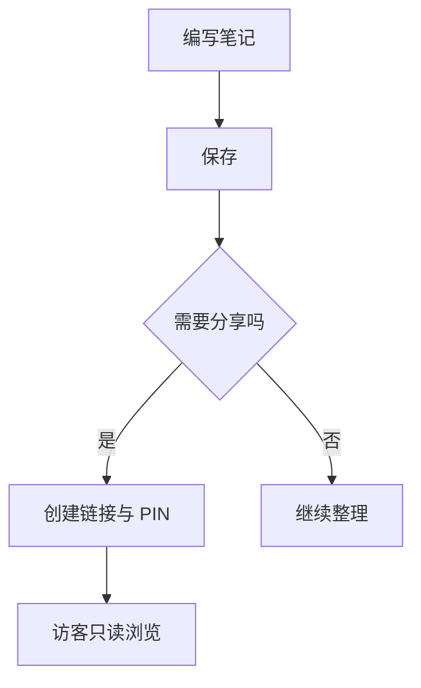
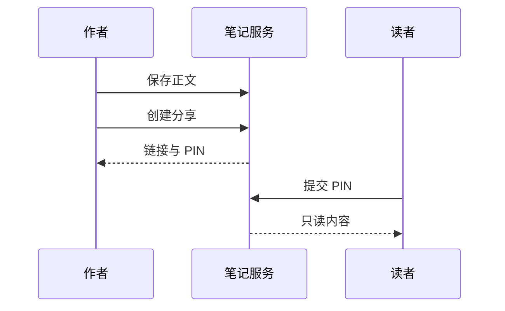
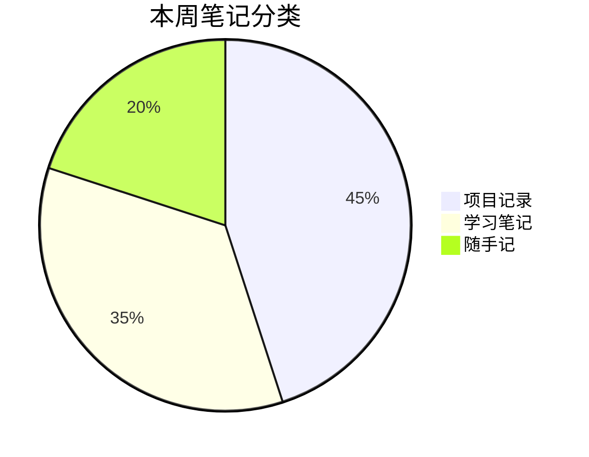

# Markdown 排版与媒体样例

这是一篇可直接编辑的示例笔记，集中展示文字排版、表格、公式、图表和媒体。

## 1. 文字与段落

普通文字、**加粗文字**、*斜体文字*、***加粗斜体***、~~删除线~~，以及行内代码 `const message = 'Hello Markdown';`。

中文与 English 可以混排。例如：使用 Markdown 记录想法，用 TeX 表达数学，用 Mermaid 描述流程。

这是一个新段落。下面这一行使用两个尾随空格换行：  
这一行仍属于同一段落。

### 三级标题：阅读层次

#### 四级标题：补充说明

> 好的笔记应当让未来的自己读得懂。
>
> **提示：** 分享只读页面会保留这里的排版。
>
> > 引用也可以嵌套。

---

## 2. 列表

### 无序列表

- 项目计划
  - 收集资料
  - 整理需求
- 开发记录
  - 实现功能
  - 验证结果

### 有序列表

1. 创建一篇笔记。
2. 填写标题和正文。
3. 保存后切换到阅读视图。
4. 按需创建带 PIN 的分享。

### 任务列表

- [x] 整理 Markdown 样式
- [x] 添加公式和图表
- [ ] 写下自己的内容

## 3. 链接与图片

[访问 Markdown 指南](https://www.markdownguide.org/)

下面的图片展示葡萄柚切片：


*图片来自 MDN 公开演示资源。*

## 4. 表格

| 内容类型 | 示例 | 状态 | 数量 |
| :--- | :---: | :---: | ---: |
| 文本 | **重点内容** | 已完成 | 12 |
| 代码 | `console.log()` | 已完成 | 3 |
| 公式 | $E = mc^2$ | 已完成 | 5 |
| 媒体 | 图片与视频 | 待补充 | 2 |

表格包含左对齐、居中和右对齐，也可以嵌入行内样式与公式。

## 5. 代码块

```javascript
async function loadNotes() {
  const response = await fetch('/api/notes');
  if (!response.ok) throw new Error('请求失败');
  const result = await response.json();
  return result.notes;
}
```

```json
{
  "title": "项目记录",
  "tags": ["Markdown", "笔记"],
  "published": false
}
```

```sh
npm run build
npm test
```

## 6. TeX 数学公式

行内公式：质能关系 $E = mc^2$，勾股定理 $a^2 + b^2 = c^2$。

### 二次方程求根

$$
x = \frac{-b \pm \sqrt{b^2 - 4ac}}{2a}
$$

### 求和与积分

$$
\sum_{k=1}^{n} k = \frac{n(n+1)}{2}
\qquad
\int_0^1 x^2\,dx = \frac{1}{3}
$$

### 矩阵

$$
A = \begin{bmatrix}
1 & 2 & 3 \\
4 & 5 & 6 \\
7 & 8 & 9
\end{bmatrix}
$$

### 分段函数

$$
|x| = \begin{cases}
x, & x \geq 0 \\
-x, & x < 0
\end{cases}
$$

### 多行推导

$$
\begin{aligned}
(a+b)^2 &= (a+b)(a+b) \\
&= a^2 + 2ab + b^2
\end{aligned}
$$

## 7. Mermaid 图表

### 流程图



### 时序图



### 饼图



## 8. 视频

下面是 MDN 的花朵视频演示。使用原生播放器，可播放、暂停、拖动进度和全屏。

<video controls preload="metadata" src="https://mdn.github.io/shared-assets/videos/flower.mp4"></video>

## 9. 小结

| 元素 | 本文位置 |
| --- | --- |
| 标题、强调、引用、分隔线 | 第 1 节 |
| 列表与任务列表 | 第 2 节 |
| 链接与图片 | 第 3 节 |
| 表格与代码 | 第 4、5 节 |
| TeX 公式 | 第 6 节 |
| Mermaid 图表 | 第 7 节 |
| 视频 | 第 8 节 |

> 外链媒体需要网络连接。导入本地笔记库时若下载成功，会改为笔记附件，不再依赖外部媒体站点。